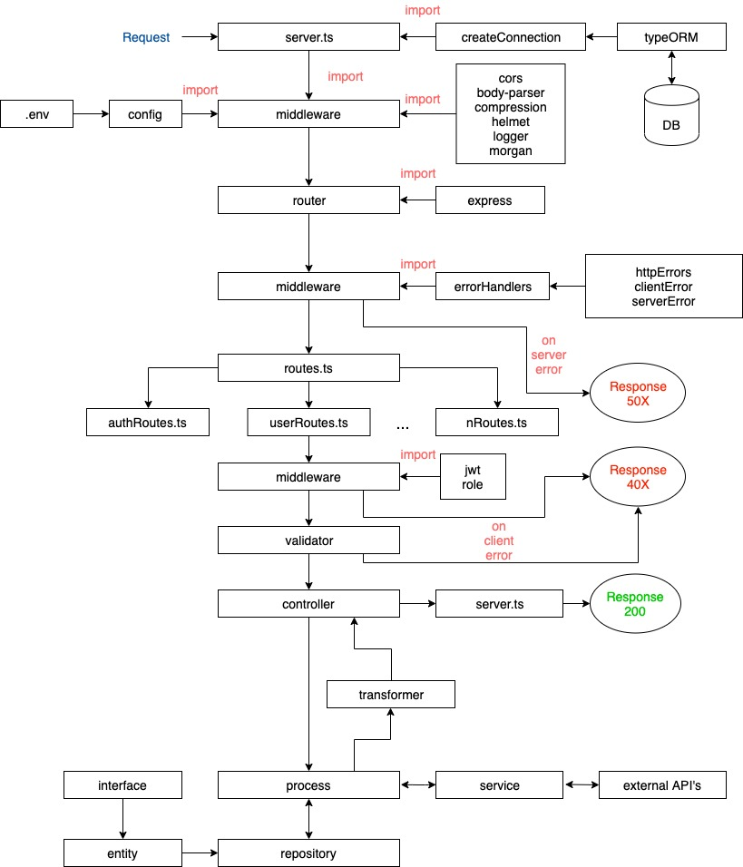

# Skeleton Node

Skeleton Node is a RESTful API framework build on top of Express.

It offers a ready-to-use architecture based on the Laravel framework, including authentication and role-based authorization, database interaction with TypeORM, connection to external RESTful API's using axios, unit and integartion testing.

## Requirements

- node.js 10.16
- typescript 3.6
- npm 6.12
- pm2 4.1

These packages must be installed globally.

\*\* Example: `npm install typescript -g`

## Quick start

1. Clone the repo to your local folder
1. Run `cp .env.example .env` command
1. Add your configuration to .env file
1. Run `npm install` command
1. Run `npm start` command

The process will start running on a pm2 instance.

---

## Typescript vs Javascript

Typescript is ES6 with strong typing.

"Typescript is Javascript for application-scale development" - TS definition.

Read more: https://www.typescriptlang.org/
___

## Project structure

```
Project
|--dist                             // compiled project source code
|--logs                             // place to store logs
|   |--error-YYYY-MM-dd.log         // timestamped error logs
|   |--info-YYYY-MM-dd.log          // timestamped info logs
|   |--requests-YYYY-MM-dd.log      // timestamped requests logs
|--src                              // typescript source code
|   |--config                       // configuration files
|   |   |--config.ts                // main configuration file
|   |--docs                         // place to store documentation
|   |   |--postman                  // place to store postman collections
|   |       |--pm_collection.json   // postman collection
|   |--http                         // place to store related http requests, controllers,...
|   |   |--controllers              // place to store controllers
|   |   |   |--authController.ts    // sample authentication controller
|   |   |   |--usersController.ts   // sample users controller
|   |   |--entities                 // place to store entities (a.k.a models)
|   |   |   |--User.ts              // sample user entity
|   |   |--middleware               // place to store related http middleware
|   |   |   |--jwt.ts               // sample jwt middleware
|   |   |   |--role.ts              // sample role validation middleware
|   |   |--migrations               // place to store migration scripts (seeders)
|   |   |   |--CreateAdminUser.ts   // sample migration script
|   |   |--processes                // place to store data manipulation processes
|   |   |   |--authProcess.ts       // sample authentication process
|   |   |--repositories             // place to store repositories
|   |   |   |--userRepository.ts    // sample script with functions to query DB
|   |   |--routes                   // place to store de-coupled routes for each controller
|   |   |   |--authRoutes.ts        // sample authentication routes
|   |   |   |--usersRoutes.ts       // sample users routes
|   |   |--services                 // place to store scripts related to external services
|   |   |   |--jsonPlaceholderService.ts  // sample external service
|   |   |--transformers             // place to store data transformers
|   |   |   |--errorTransformer.ts  // script to format error messages
|   |   |--validators               // place to store validation scripts
|   |       |--authValidator.ts     // script with functions to validate authentication
|   |       |--validator.ts         // sample validator script
|   |--middleware                   // place to store common express middleware
|   |   |--common.ts                // common http middleware
|   |   |--errorHandlers.ts         // sample http error handlers using express router
|   |   |--index.ts                 // entry point for middleware
|   |--tests                        // place to store tests
|   |   |--processes                // place to store unit testing scripts
|   |   |--routes                   // place to store integration testing scripts
|   |   |--services                 // place to store unit testing scripts
|   |--utils                        // utilitarian scripts and functions
|   |   |--ErrorHandler.ts          // sample http response errors
|   |   |--httpErrors.ts            // sample Error classes
|   |   |--index.ts                 // entry point for utils
|   |   |--Logger.ts                // logger script
|   |   |--validator.ts             // sample validator script
|   |--routes.ts                    // unifies all routes to export to server.ts
|   |--server.ts                    // start point of application
|--.env                             // file with environment variables
|--.env.example                     // sample file with environment variables
|--.gitignore                       // sample .gitignore file
|--ormconfig.json                   // sample ORM configuration file
|--package-lock.json                // dependency lock file
|--package.json                     // sample script with tasks and dependencies
|--pm2.yaml                         // sample pm2 file with configuration parameters
|--tsconfig.json                    // typescript compiler configuration file
```

## Request flow



___

## Folder overview

### Middleware

The middleware layer deals with common HTTP libraries to add functionality to the server.

These middleware is applied directly to the express object, instead of the server; this, to prefer modularity and low-coupling.

Import libraries:

```javascript
import { Router } from "express";
...
import cors from "cors";
import parser from "body-parser";
import compression from "compression";
import helmet from "helmet";
...
```

Add functionality to the router:

```javascript
export const handleBodyRequestParsing = (router: Router) => {
  router.use(parser.urlencoded({ extended: true }));
  router.use(parser.json());
};
```

Import all handlers to the index:

```javascript
import {
  handleCors,
  handleBodyRequestParsing,
  handleCompression,
  handleHelmet,
  ...
} from "./common";

export default [
  handleCors,
  handleBodyRequestParsing,
  handleCompression,
  handleHelmet,
  ...
];

```

### Controllers

The controllers layer deals only with taking the request, passing it to the process, and return the proper response with status code.

- pass the Request, Response, and NextFunction objects as parameters.
- use res.status(status_code).send(response_object); to make graceful response.

```javascript
export const register = async (req: Request, res: Response, next: NextFunction) => {
  try {
    const user: User = req.body;
    const response = await authProcess.register(user);
    res.status(200).send(response);
  } catch (error) {
    clientError(error, res, next);
  }
};
```

### Processes

The processes layer deals with adding logic to handle the incoming data taken from the request object.

```javascript
export const register = async (user: User) => {

  /** 
   * add code to process the User object
  */

  await userRepository.register(user);
  return { status: "ok", message: "User has been registered" };
};
```

### Services

The services layer deals with connecting to external services or api's.

Once the service responds, the data is sent back to the process layer.

\*\*The following example shows the retrieval of users from the JSONPlaceholder REST API.

```javascript
export const getUsers = async () => {
  const url = process.env.JSON_PLACEHOLDER_ULR;
  const response = await axios.get(`${url}/users`);
  return response;
};

```

### Repositories

The repositories layer deals with querying the database.

The Active Record pattern is used here to define query methods inside the entity itself.

TypeORM offers out-of-the-box querying methods (find, findOne, findById, ...), as well as operators to create comparisons.

TypeORM also offers a QueryBuilder feature, which allows to build SQL queries with convenient syntax.

```javascript
export const findById = async (id: number) => {
  const userRepository = getRepository(User);
  const user = await userRepository.findOneOrFail(id);
  return user;
};

export const findByUsername = async (username: string) => {
  const userRepository = getRepository(User);
  const user = await userRepository.findOne({ where: { username } });
  return user;
};
```

Alternative using QueryBuilder:

```javascript
const firstUser = await connection
    .getRepository(User)
    .createQueryBuilder("user")
    .where("user.id = :id", { id: 1 })
    .getOne();
```

Refer to the official docs to read more: https://typeorm.io/

### Transformers

The transformers layer deals with transforming the response object returned by the process layer to make it more suitable for the response.

#### \*\* Important

It is not mandatory to define a transformer for each response, only when necessary.

### Validators

The validators layer daels with validating the request object before sending it back to the controller. 

This, because it is prefered to make sure that the data that is passed to the controller is correct; if it is not, the validator returns an HTTP 422 validation error.

```javascript
export const validateRegister = (req: Request, res: Response, next: NextFunction) => {
  const data = req.body;
  const rules = {
    username: "required|string|min:4|max:20|username_available",
    password: "required|string|min:4|max:20",
    role: ["required", { in: ["ADMIN", "USER"] }]
  };

  const validator = new Validator(data, rules);
  const passes = () => {
    next();
  };
  const fails = () => {
    const formatedErrors = transformValidationErrors(validator.errors);
    res.status(422).send(formatedErrors);
  };

  validator.checkAsync(passes, fails);
};
```

---

## Database configuration

### TypeORM

The project uses TypeORM as its relational mapper. It supports different SQL dialects like SQlite, MySQL, MariaDB, SQLServer.

Some of its functionality includes:

- Synchronization
- Migrations
- Entities
- Repositories
- Relations
- Async transactions

Refer to the official docs to dive deeper: https://typeorm.io/

### Installation

Run `npm install typeorm -g` command.

This allows running commands from the TypeORM cli to create migrations.

### Configuration

To set the connection to the database modify the following parameters in .env file:

```bash
TYPEORM_CONNECTION = mysql
TYPEORM_HOST = <your_host>
TYPEORM_USERNAME = <your_username>
TYPEORM_PASSWORD = <your_password>
TYPEORM_DATABASE = <your_database>
TYPEORM_PORT = 3306
TYPEORM_SYNCHRONIZE = false
TYPEORM_LOGGING = false
```

#### \*Important:

- The parameters `synchronize` and `logging` must only be set to `true` during development, otherwise, current data in database will be overwritten.

- The database schema must be created before making the connection.

### Migrations

TypeORM allows running migration scripts to seed the database with initial values.

If you need to create a new migration run the following command:

```bash
typeorm migration:create -n MigrationName
```

This will save a time-stamped migration script in the /dist/http/migrations folder. Edit the file with suitable data.

To run the migrations run the following command:

```bash
npm run migration:run
```

---

## Authentication and authorization

The authentication and authorization middleware is supported on [bcrypt](https://jwt.io/introduction/) and [jwt](https://jwt.io/introduction/).

### Authentication

Users' passwords are first hashed using bcrypt hashing functions and then saved to the database.

It is important to note that bcrypt allows using different hashing methods, as well as, setting a salt value and use Base64 encoding.

### Authorization

The users have role-base authorization, which means, only some roles can access certain server resources.
The role is validated in a middleware which grants or rejects user permissions.

Once the user logs in, a jwt token will be set in the request header, with an expiration time (1 hour). The token is signed end-to-end using a secret value.

---

## Error handling

The error handling is based on the [node.js best practices guide](https://github.com/goldbergyoni/nodebestpractices#2-error-handling-practices).

In short:

- Custom errors (HTTP401, HTTP403,..) extend from the Error object.
- Abstract classes define the error status code and message.

```javascript
export abstract class HTTPClientError extends Error {
  readonly statusCode!: number;
  readonly name!: string;
  data: string;

  constructor(message: object | string) {
    if (message instanceof Object) {
      super(JSON.stringify(message));
    } else {
      super(message);
    }
    this.name = this.constructor.name;
    Error.captureStackTrace(this, this.constructor);
  }
}
```

- These errors are handled by a central error handler (clientError handler)

```javascript
const handleClientError = (router: Router) => {
  router.use((err: Error, req: Request, res: Response, next: NextFunction) => {
    ErrorHandler.clientError(err, res, next);
  });
};
```

- In the case of uncaughtException or unhandledRejection errors, the process will terminate and register the error.
- The project architecture follows a validation-first approach, minimizing possible unhandled errors before passing to the next process.

---

## Logging

The project includes logging middleware for different types of requests.
These logs are timestamped, formatted, and printed out to console (in development mode) and saved to the logs folder.
The project uses [winston](https://www.npmjs.com/package/winston) and [morgan](https://www.npmjs.com/package/morgan-body) as middleware to manage logs.

### Request logs

The request logs store data with the following structure:

```json
{
  "message": {
    "method": "GET",
    "endpoint": "/api/v1/users",
    "client": "::1",
    "sessionId": "WRgK3UaufkmZY97H0Z8gFm1_aPLh34no",
    "headers": {
      "authorization": "eyJ.jwt.token",
      "user-agent": "PostmanRuntime/7.18.0",
      "accept": "*/*",
      "cache-control": "no-cache",
      "postman-token": "194d662e-619d24ac3b01",
      "host": "localhost:3000",
      "accept-encoding": "gzip, deflate",
      "connection": "keep-alive"
    },
    "params": {},
    "query": {},
    "body": {}
  },
  "level": "info",
  "timestamp": "2019-10-25 10:55:01"
}
```

### Response logs

The response logs store data with the following structure:

```json
{
  "message": {
    "statusCode": 200,
    "method": "GET",
    "endpoint": "/api/v1/users"
  },
  "level": "info",
  "timestamp": "2019-10-25 10:55:02"
}
```
___

## Testing

The project supports both unit and integration testing using [jest](https://jestjs.io/docs/en/getting-started) and [supertest](https://www.npmjs.com/package/supertest).

#### \*Important:

The postman collection includes end-to-end tests for stress testing.

### Unit testing

Unit testing is done to the following layers:

- processes
- services

However, it is worth noting that unit testing can be done to every 'unit' of the application.

### Integration testing

Integration testing is done to the routes layer to test every endpoint.

#### Running tests

Run `npm run test` command to run both tests.

___

## Adding features, code fix,...

The following are the suggested steps to add more features to the project.

### Routes

1. Create a new route.
1. Add validation to the request object (params, query, body, header,...).
1. Add middleware to check jwt, roles, .. (if necessary).
1. Add controller logic.
1. Add process logic.
1. Add service logic (if necessary).
1. Call repository or add repository logic (if necessary).
1. Call transformer or add transformer logic (if necessary).
1. Write unit test and integration test.
1. Run tests and check for functionality bugs or errors.
1. Make pull request.

### Features

1. Create a new feature (validator, transformer, process, middleware, ...).
1. Write unit test and integration test.
1. Run tests and check for functionality bugs or errors.
1. Make pull request.

### Bug fixes

1. Fix bug.
1. Create a new feature (validator, transformer, process, middleware, ...).
1. Write unit test and integration test.
1. Run tests and check for functionality bugs or errors.
1. Make pull request.

#### \*\* Important:
Avoid using .then().catch() chaining methods to handle promises. Instead, prefer the more readable asyn-await syntax to favor readability and avoid nested promises and callback hell.

---

## Environments

The project includes scripts for different environments, such as, development and production.

### Development

To start the development environment:

1. Run `npm install` command.
1. Run `npm run dev` command.

This will start the project and will watch for changes in code.
The project will be auto-compiled after every save command.

### Production

To start the production environment:

1. Run `npm install` command.
1. Run `npm start` command.

This will build the project and start a pm2 instance.

#### \*Important:

Set the environment variable `NODE_ENV=production` only when the project is ready to be deployed, to avoid performance issues and logging to console.

In development mode this variable should be commented out.
